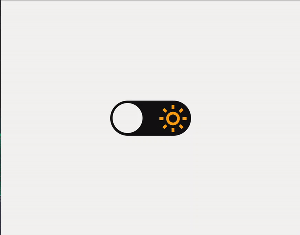

# <h1 align="center">Theme Switcher - Extra Challenge</h1>

 Extra Challenge | Stage 02 - Rockeseat Explorer course

 Practicing html, css and javascript.

  <a href="#-Technologies">Technologies</a>&nbsp;&nbsp;&nbsp;|&nbsp;&nbsp;&nbsp;
  <a href="#-Project">Project</a>&nbsp;&nbsp;&nbsp;|&nbsp;&nbsp;&nbsp;
  <a href="#-License">License</a>

  

## 🚀 Technologies

- HTML e CSS
- JavaScript
- Git e Github
- Figma

## 💻 Project

  

## 📝 License

  

 
